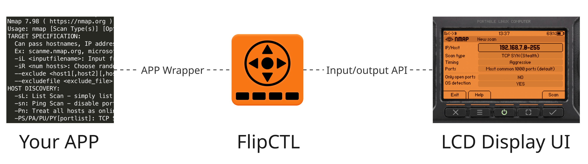
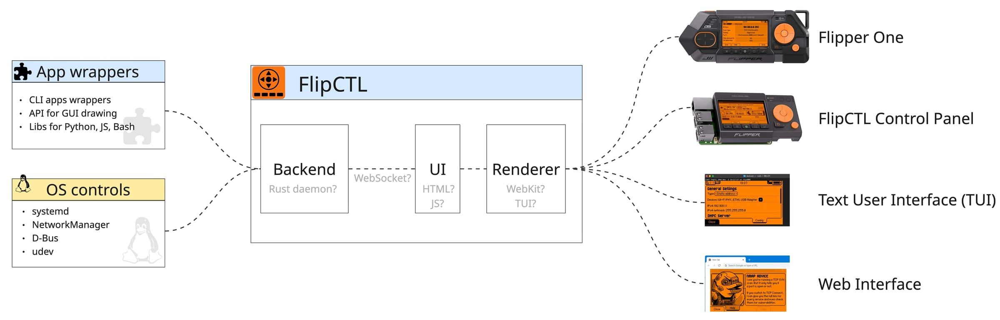
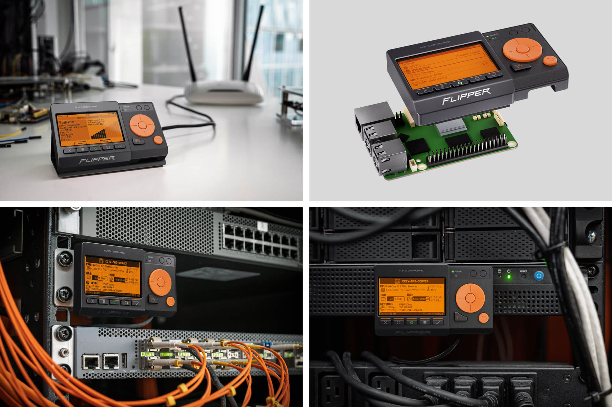
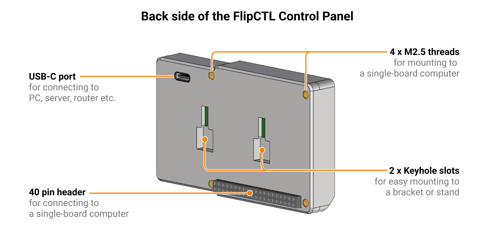

# FlipCTL — a UI framework for embedded Linux systems

FlipCTL is a lightweight UI framework for embedded and headless Linux systems, designed as a modern replacement for traditional HMI solutions. Originally built for Flipper One, it runs on any Linux system — from servers and routers to single-board computers, without requiring a desktop environment.

On one side, FlipCTL interacts with the operating system and wrappers around command line utilities such as `ping` and `nmap`. On the other, it enables users to control the system through various control interfaces, such as a web browser, an SSH terminal, or a physical control panel with an LCD display.

> [!NOTE]
> We are looking for a Software Architect to join the FlipCTL project. Learn more [here](#how-to-contribute).

## Architecture

Core Components of FlipCTL:

* **Backend** is responsible for managing the operating system itself. It can interact with systemd, control OS services, configure networking through NetworkManager or systemd-networkd, and wrap existing command-line utilities such as nmap, ping, and traceroute. The backend exposes these capabilities through APIs that are consumed by the frontend.

* **UI Frontend** is currently built using HTML and JavaScript. Despite the associated overhead, this approach enables rapid UI development and compact implementation, while avoiding the need for specialized expertise required by many embedded UI frameworks.

* **Renderer** is a web browser. On Flipper One, we currently use a headless WebKit instance running directly on top of DRM (Direct Rendering Manager), without Xorg or Wayland. We also want to support multiple renderer options, for example, TUI (Text User Interface) for using  directly from the console.

* **App Wrappers** integrate standard Linux command line applications into FlipCTL, providing controls for managing them and displaying their output.

* **Control Interfaces** are the devices and applications used to control FlipCTL:
    * Flipper One.
    * FlipCTL Control Panel.
    * TUI (Text UI) via a local terminal or SSH.
    * Web browser or desktop application.

## FlipCTL Control Panel

FlipCTL Control Panel is a compact device featuring the same display as the Flipper One, along with physical buttons and a couple of LEDs. It provides full control over FlipCTL and can also emulate Power and Reset button presses on the host system using built-in relays.

### Mounting options

FlipCTL Control Panel can be:

* placed on a desk (using a desktop stand);
* mounted on a server or PC case;
* mounted to server rack (using a mounting bracket);
* mounted directly to an SBC (single-board computer) using screws and standoffs.

> [!NOTE]
> When mounted on an SBC, [brass standoffs](https://thepihut.com/products/brass-m2-5-standoffs-16mm-tall-black-plated-pack-of-2) and a [GPIO riser header](https://thepihut.com/products/gpio-riser-header-for-raspberry-pi) can be used to provide additional clearance for cooling of the SBC's chips.

### Host connectivity options

FlipCTL Control Panel supports two host interfaces for communication with and power supply from the host system:
* **USB 2.0** via the USB-C connector on the back of the device. Suitable for connecting to servers, routers, PCs, and virtually any other host system.
* **SPI** via the 40-pin header on the back of the device. Designed for direct connection to single-board computers (SBCs). 

> [!NOTE]
> The choice of SPI is not final yet. We are discussing it in [this issue]().

FlipCTL also features a 2.54 mm pitch header (not shown on the image above) for connecting to the host motherboard's front panel connector, usually labeled F_PANEL. This enables local or remote control of the host's power and reset functions through FlipCTL.

## How to contribute

This page provides a high level overview of FlipCTL and its architecture. While the core concepts are defined, there are many ways to implement them in practice. We invite the community to propose a concrete architecture for FlipCTL by submitting a Pull Request to this repository. The author of the most compelling architecture proposal may be invited to take on the role of Project Architect and help shape the future of FlipCTL.

A Pull Request should include:

- A description of your proposed FlipCTL architecture implementation, including the components you would use and how they would interact with each other.

- A description of your vision for the plugin system and the wrappers for standard command-line utilities like `ping` or `nmap`.

- A minimal working FlipCTL prototype capable of driving multiple frontends. One frontend should be a Web UI, while another should be a TUI.

## Links

* [FlipCTL page](https://docs.flipper.net/one/cpu-software/flipctl) on the Flipper One Dev Portal.
* [Blog post](https://blog.flipper.net/) about FlipCTL in the Flipper Devices blog.